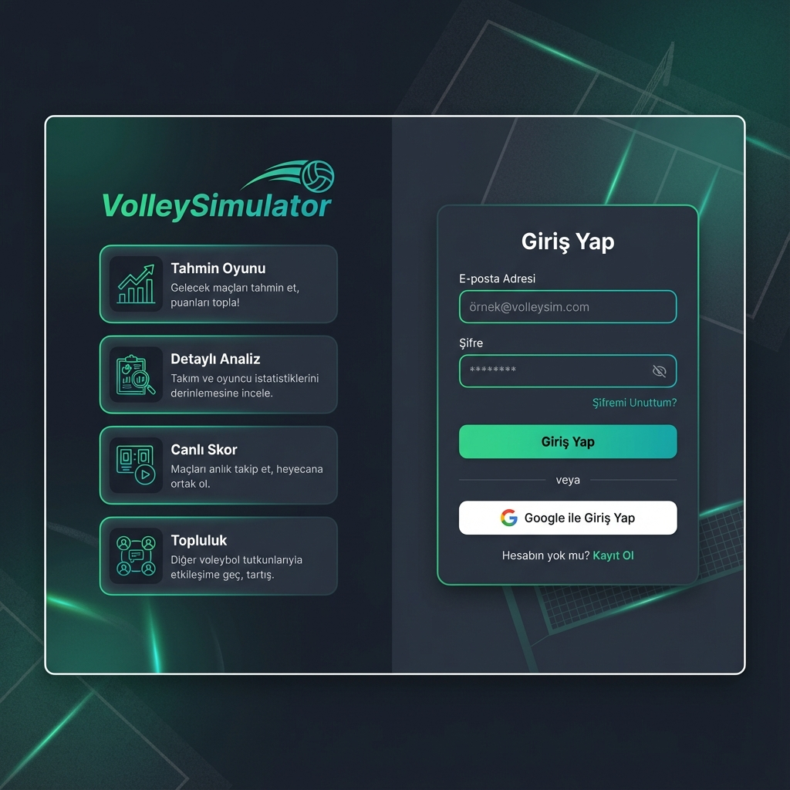
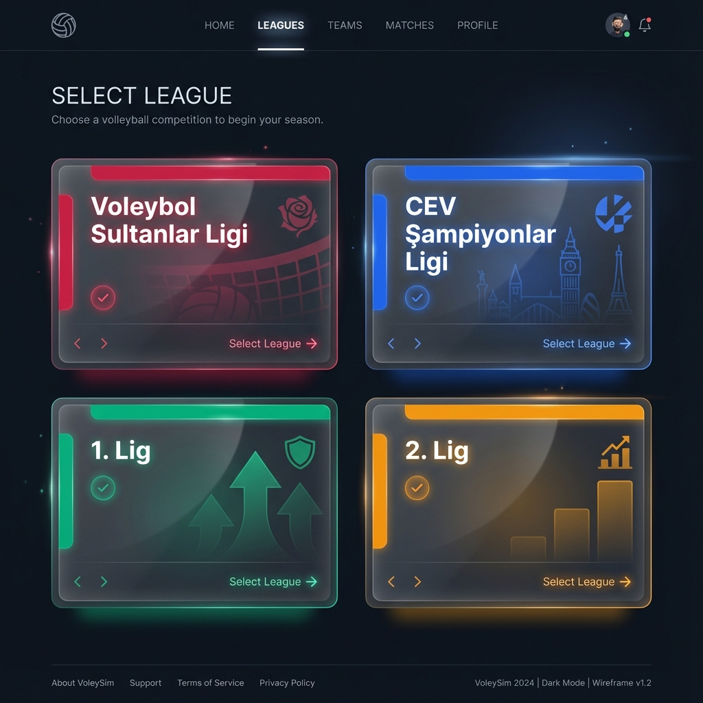
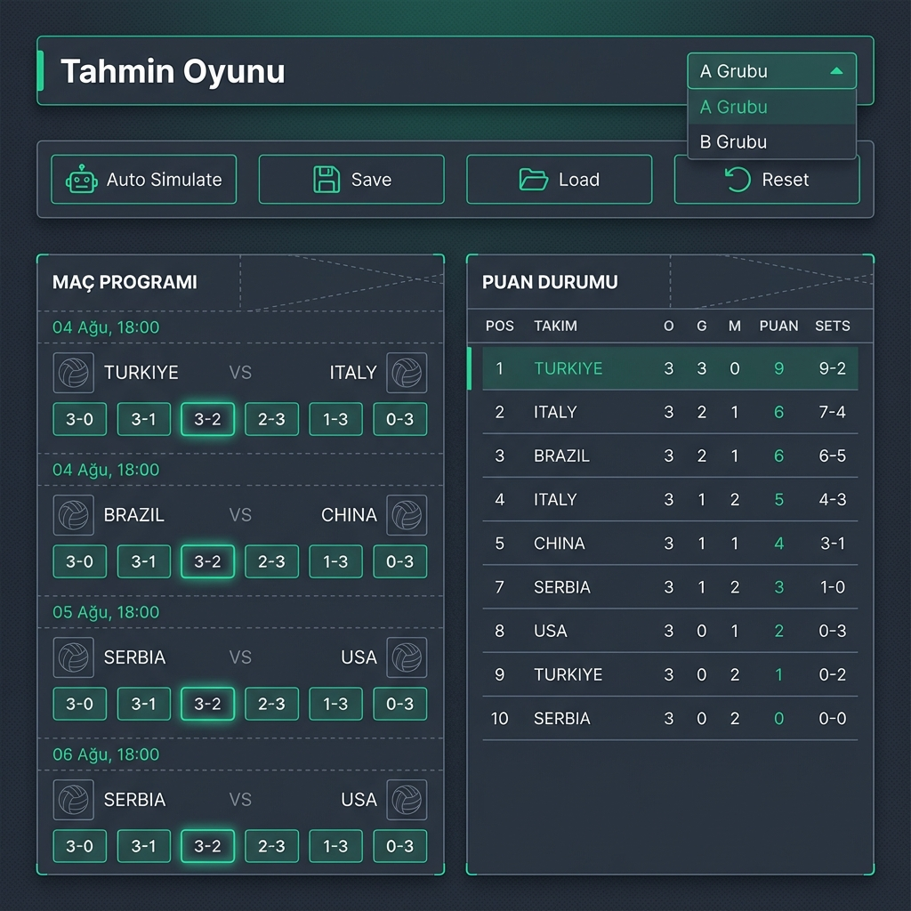
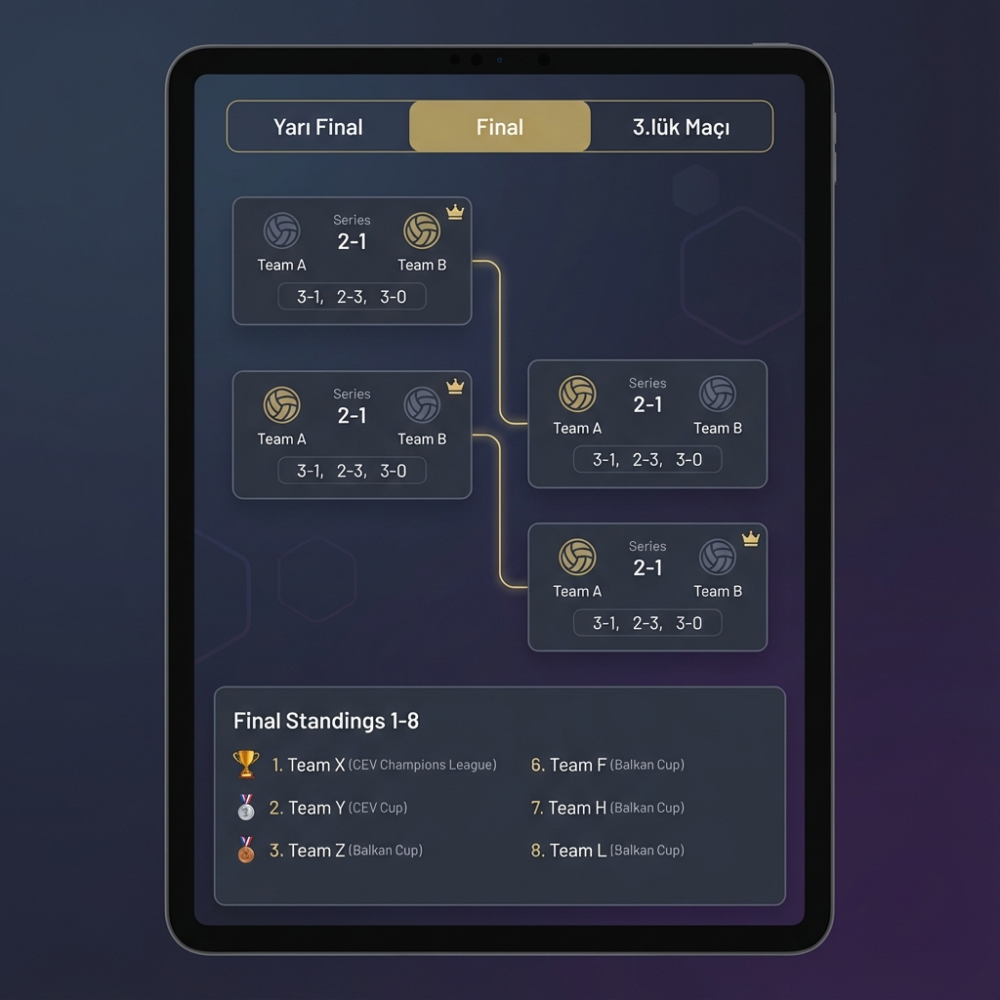

# VolleySimulator - Proje Özeti

> **Voleybol tutkunları için yeni nesil simülasyon ve tahmin platformu**

## 🎯 Proje Amacı

VolleySimulator, Türkiye voleybol liglerini ve Avrupa kupalarını takip eden kullanıcıların maç sonuçlarını tahmin edebileceği, senaryolar oluşturabileceği ve playoff simülasyonları yapabileceği interaktif bir web uygulamasıdır.

---

## 📸 Arayüz Tasarımı

### 1. Giriş Sayfası
Login sayfası, kullanıcı kimlik doğrulaması ve uygulama tanıtımını birleştiren modern bir tasarıma sahiptir.



**Özellikler:**
- Email/şifre ile giriş
- Google OAuth entegrasyonu
- Özellik tanıtım kartları
- Kayıt ol yönlendirmesi

---

### 2. Lig Seçimi
Kullanıcıların takip etmek istedikleri ligi seçebileceği ana sayfa.



**Desteklenen Ligler:**
- 🔴 Voleybol Sultanlar Ligi (VSL)
- 🔵 CEV Şampiyonlar Ligi
- 🟢 1. Lig
- 🟠 2. Lig

---

### 3. Tahmin Oyunu
Maç sonuçlarını tahmin etme ve puan toplama arayüzü.



**Bileşenler:**
- Grup seçici dropdown
- Fikstür kartları (skor seçimi butonları)
- Canlı puan tablosu
- Aksiyon çubuğu (Otomatik simüle, Kaydet, Yükle, Sıfırla)
- XP ve seviye göstergesi

---

### 4. Playoff Simülasyonu
Playoff eşleşmeleri ve final sıralaması görüntüleme.



**Özellikler:**
- Tab bazlı navigasyon (Yarı Final, Final, 3.lük)
- Seri skor takibi (örn: 2-1)
- Maç bazlı skor girişi
- Final sıralaması (1-8)
- Avrupa kupası kontenjan bilgisi

---

## 🛠 Teknoloji Stack

| Katman | Teknoloji |
|--------|-----------|
| Frontend | Next.js 16, React, TypeScript |
| Styling | Tailwind CSS |
| Backend | Supabase (PostgreSQL, Auth) |
| State | React Query (@tanstack/react-query) |
| Hosting | Vercel |
| Analytics | Google Analytics, Vercel Analytics |

---

## 📁 Proje Yapısı

```
app/
├── 1lig/            # 1. Lig sayfaları
├── 2lig/            # 2. Lig sayfaları
├── vsl/             # Sultanlar Ligi sayfaları
├── cev-cl/          # CEV Şampiyonlar Ligi sayfaları
├── components/      # Paylaşılan bileşenler
├── hooks/           # Custom React hooks
├── utils/           # Yardımcı fonksiyonlar
├── api/             # API route'ları
└── context/         # React Context providers
```

---

## 🎮 Ana Özellikler

1. **Tahmin Oyunu** - Maç skorlarını tahmin et, XP kazan
2. **Otomatik Simülasyon** - Akıllı (ELO-based) veya rastgele skor doldurma
3. **Playoff Simülatör** - Playoff senaryoları oluştur
4. **Canlı Sıralama** - Tahminlere göre anlık puan tablosu
5. **Gamification** - XP, seviye, rozetler, günlük görevler
6. **Cross-Device Sync** - Supabase ile veri senkronizasyonu

---

## 🌐 Canlı Demo

**URL:** [https://www.volleysimulator.com.tr](https://www.volleysimulator.com.tr)

---

## 📅 Son Güncelleme

**Tarih:** 2 Ocak 2026

**Son Değişiklikler:**
- Final sıralaması (1-8) görünümü eklendi
- Avrupa kupası kontenjan bilgisi güncellendi
- Maç etiketleri "Ev vs Deplasman" formatına çevrildi
